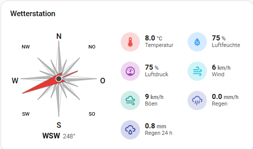

# Weather Station Card

[](https://my.home-assistant.io/redirect/hacs_repository/?owner=GB-1972&repository=HA-Weatherstation-Card&category=plugin)

A Home Assistant Lovelace card in **Mushroom style** showing a 16-point compass rose with a wind-direction arrow plus configurable chips for **temperature, humidity, pressure, wind speed, wind gusts, UV index, current rain and rain over the last 24 hours**.



## Features

- **16-point compass rose** drawn as inline SVG — no images, no external assets
- **Red wind-direction arrow** that rotates smoothly to the current heading
- **Wind-direction invert** — optional toggle to show the direction the wind blows *to* instead of where it comes *from*
- **Eight sensor chips** in Mushroom style — temperature, humidity, pressure, wind, gusts, UV index, rain, rain 24 h. Each is optional; unconfigured chips are hidden automatically
- **Per-metric color thresholds** — chip icons can change color based on the value (e.g. temperature blue → green → yellow → red, or rain grey → blue). Configured in a dedicated **Colors** editor tab
- **Visual editor** with entity selectors for every field — no YAML required
- **Wind direction input** accepts either a degree value (0–360) **or** a text label (`N`, `NE`/`NO`, `E`/`O`, `SE`/`SO`, …). Both English and German abbreviations are recognised
- **Units auto-detected** from each entity's `unit_of_measurement` attribute, with fallbacks (`°C` / `%` / `hPa` / `km/h` / `mm`)
- **Click any chip** (or the compass) to open the entity's more-info dialog
- **Responsive** — 2-column chip grid on wide cards, single column on narrow screens
- Uses Home Assistant theme variables, so it inherits your light/dark theme automatically

> The visible labels on the card and the editor are currently in **German**
> (Temperatur, Luftfeuchte, Wind, Böen, Regen, …). A multilingual switch is on
> the roadmap. Until then, override individual labels by configuring different
> `friendly_name`s on your sensors and reading them in the More-Info dialog, or
> fork the card and adjust the strings in `_renderChips` / `_label`.

## Installation

Install via **HACS** (Home Assistant Community Store). HACS will place the card
under `/hacsfiles/` automatically — there is no `/local/` install path for this
card.

1. In Home Assistant, open **HACS → Frontend → ⋮ menu → Custom repositories**
2. Add this repository URL with category **Dashboard**
3. Search for "Weather Station Card" in HACS and install
4. HACS usually registers the Lovelace resource automatically. If not, add it
   manually under **Settings → Dashboards → Resources**:
   ```yaml
   url: /hacsfiles/HA-Weatherstation-Card/weatherstation-card.js
   type: module
   ```
5. Hard-reload your browser (Ctrl+F5) after install

> **Don't have HACS yet?** See <https://hacs.xyz/> for the one-time HACS setup.
> Once installed, follow the steps above.

## Quick Start

Minimal — only the four most common values:

```yaml
type: custom:weatherstation-card
title: Weather
temperature: sensor.outdoor_temperature
humidity: sensor.outdoor_humidity
pressure: sensor.outdoor_pressure
wind_speed: sensor.wind_speed
```

Full configuration with compass and rain:

```yaml
type: custom:weatherstation-card
title: Weather Station
temperature: sensor.outdoor_temperature
humidity: sensor.outdoor_humidity
pressure: sensor.outdoor_pressure
wind_speed: sensor.wind_speed
wind_gust: sensor.wind_gust
wind_direction: sensor.wind_direction   # degrees 0–360 OR text (N, NE, ...)
wind_direction_invert: false             # true → show where wind blows TO
uv_index: sensor.uv_index
rain_current: sensor.rain_current        # in mm
rain_24h: sensor.rain_24h                # in mm

# Optional: per-metric icon color thresholds (color applies from value upward)
color_thresholds:
  temperature:
    - value: -10
      color: "#2196f3"   # cold → blue
    - value: 10
      color: "#4caf50"   # mild → green
    - value: 22
      color: "#ffeb3b"   # warm → yellow
    - value: 30
      color: "#f44336"   # hot  → red
  rain_current:
    - value: 0
      color: "#9e9e9e"   # dry  → grey
    - value: 0.1
      color: "#2196f3"   # rain → blue
```

Everything is also editable through the visual editor — no YAML knowledge required.

## Options

| Option                  | Type     | Description                                                                                  |
| ----------------------- | -------- | -------------------------------------------------------------------------------------------- |
| `title`                 | string   | Card title shown above the compass (default `"Weather Station"`)                             |
| `temperature`           | entity   | Sensor reporting current temperature                                                         |
| `humidity`              | entity   | Sensor reporting relative humidity                                                           |
| `pressure`              | entity   | Sensor reporting atmospheric pressure                                                        |
| `wind_speed`            | entity   | Sensor reporting wind speed                                                                  |
| `wind_gust`             | entity   | Sensor reporting wind gust speed                                                             |
| `wind_direction`        | entity   | Sensor reporting wind direction (degrees `0`–`360` **or** text like `NE`)                    |
| `wind_direction_invert` | boolean  | `true` adds 180° → arrow/caption show the direction the wind blows **to** (default `false`)  |
| `uv_index`              | entity   | Sensor reporting the UV index                                                                |
| `rain_current`          | entity   | Sensor reporting current rain amount (mm)                                                    |
| `rain_24h`              | entity   | Sensor reporting rain over the last 24 h (mm)                                                |
| `color_thresholds`      | object   | Per-metric icon color thresholds — see [Color thresholds](#color-thresholds)                 |

Leave any entity option blank to hide that chip.

### Wind direction conventions

The red arrow points in the direction indicated by the sensor value. Most
Home Assistant weather integrations report wind direction as the direction
the wind is *coming from* — that's what the card displays by default.

If you want the arrow to show the direction the wind blows **to**, just enable
`wind_direction_invert: true` (or tick the toggle in the editor). The card adds
180° internally — no template sensor needed.

## Color thresholds

Each chip icon can change color based on its current value. Open the
**Colors** tab in the visual editor and add one or more thresholds per metric.
A threshold's color applies **from its value upward**; anything below the
lowest threshold uses the lowest threshold's color, so the whole range is
covered. Without any thresholds the chip keeps its default static color
(fully backward compatible).

YAML shape:

```yaml
color_thresholds:
  <metric>:
    - value: <number>     # apply this color from here upward
      color: "#rrggbb"
```

Valid `<metric>` keys: `temperature`, `humidity`, `pressure`, `wind_speed`,
`wind_gust`, `uv_index`, `rain_current`, `rain_24h`.

Example — temperature blue→green→yellow→red and a dry/wet rain indicator:

```yaml
color_thresholds:
  temperature:
    - { value: -10, color: "#2196f3" }
    - { value: 10,  color: "#4caf50" }
    - { value: 22,  color: "#ffeb3b" }
    - { value: 30,  color: "#f44336" }
  rain_current:
    - { value: 0,   color: "#9e9e9e" }
    - { value: 0.1, color: "#2196f3" }
```

### Accepted text labels for wind direction

`N`, `NNO`/`NNE`, `NO`/`NE`, `ONO`/`ENE`, `O`/`E`, `OSO`/`ESE`, `SO`/`SE`, `SSO`/`SSE`, `S`, `SSW`, `SW`, `WSW`, `W`, `WNW`, `NW`, `NNW`. Case is ignored.

## Compatibility

- Home Assistant 2024.x and newer (tested on 2026.x)
- Any browser with native CSS `aspect-ratio` and `color-mix` support — i.e. Chrome / Edge / Firefox / Safari from 2023 onward
- Inherits look from your active HA theme (Mushroom / Mushroom Strategy / vanilla — all fine)

## License

MIT — see [LICENSE](LICENSE).
